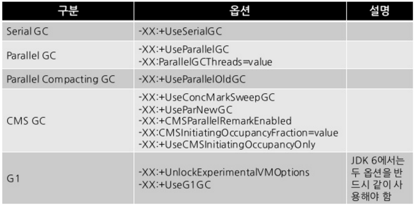

이클립스 실행 디렉토리에는 실행파일 .ini가 있습니다.<br>
열어보면 다양한 파라미터를 지정 할수 있는데 추가로 활용할 수 있는 것들이 무엇이 있는지 보겠습니다.
```
-startup
plugins/org.eclipse.equinox.launcher_1.3.100.v20150511-1540.jar
--launcher.library
plugins/org.eclipse.equinox.launcher.win32.win32.x86_64_1.1.300.v20150602-1417
-product
org.springsource.sts.ide
--launcher.defaultAction
openFile
--launcher.XXMaxPermSize
256M
-vm
../java/jdk1.8.0_72/bin/javaw.exe
-vmargs
-Dosgi.requiredJavaVersion=1.7
-Xverify:none
-Dorg.eclipse.swt.browser.IEVersion=10001
-XX:MaxPermSize=256m
-Xms40m
-Xmx1200m
```
위는 저의 이클립스 설정 정보 입니다.<br>
별도로 설정한 부분은 vm, xx:MaxPermSize, Xms, Xmx 입니다. <br>
* vm 
 - 사용할 jdk java 실행파일 위치를 지정하면 별도로 환경변수가 지정되어 있지 않아도 이클립스가 잘 실행 됩니다. 
 - 실행 로그를 보고 싶으면 javaw 를 java로 바꾸면 됩니다.
* xx:MaxPermSize
 - 메모리의 펌영역 최대 사이즈를 지정합니다.
 - 펌영역 메모리는 클래스등 스태틱 정보들이 메모리를 차지하게 되는데 많은 양의 클래스들을 로드하면서 cglib 기능등을 사용하면 클래스 정보들이 늘어나면서 메모리가 넘어가서 에러가 발생합니다. 메모리에 여유가 있다면 숫자를 늘려가면서 적당한 크기를 잡아야 합니다.
* Xms
 - 최소 힙 메모리를 의미합니다.
 - 힙영역은 실행단계에서 사용하는 메모리 영역입니다.
* Xmx
 - 최대 힙 메모리를 의미합니다.
 - 메모리를 크게 잡으면 gc 빈도가 줄어들어서 툴의 성능이 높아지는 효과가 나타납니다.
 - Xms와 동일하게 지정할 경우 메모리를 늘려서 재 할당하는 일이 없어져서 좀더 성능이 좋아진다고 합니다.
 
<br>
####추가
* clear를 맨앞줄에 넣으면 각종 설정정보를 다시 로드 합니다. 툴을 여는데 오래 걸립니다. 가끔 문제가 생기면 한번 지정해서 쓰고 다시 지우면 됩니다.
* debug를 지정하고 javaw -> java로 바꾸면 각종 실행 로그를 볼수 있습니다. 툴에 문제가 있어서 디버깅 할때 유용 합니다.

<br>

<span style="color:gray;">이미지 출처 : 구글 검색</span>

